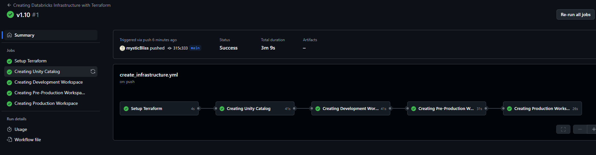

[](https://github.com/mysticBliss/databricks-multi-env/actions/workflows/create_infrastructure.yml)

# databricks-multi-env

This guide outlines the process for setting up `Databricks Platform with multiple environments using Terraform`. We'll create a Unity Catalog and then set up workspaces for development, pre-production, and production environments.

## Prerequisites

- Terraform installed
- Access to necessary Azure/Databricks accounts
- Proper permissions set up

## Directory Structure

```
databricks-multi-env/
├── configs/
│   ├── commons/
│   │   └── unity-catalog.tfvars
│   └── environments/
│       ├── dev.tfvars
│       ├── pre.tfvars
│       └── prod.tfvars
├── module/
│       ├── adb-lakehouse/
│       └── adb-uc-metastore/
│  
├── workspace/
│   └── ws-datalake/
│       ├── main.tf
│       ├── providers.tf
│       ├── variables.tf
│       └── README.md
├── shared/
│    └── unity-catalog/
│       ├── unity_catalog.tf
│       ├── providers.tf
│       ├── variables.tf
│       └── README.md
│
└── .gitignore
```

## Modules

This project uses several custom modules to manage different aspects of our Databricks infrastructure:

1. **adb-lakehouse**: This module is responsible for setting up the Databricks Lakehouse architecture. It includes configurations for Delta Lake, data storage, and compute resources.

2. **adb-uc-metastore**: This module manages the Unity Catalog metastore, which provides a centralized metadata management system for Databricks workspaces.

3. **unity-catalog**: Located in the shared directory, this module handles the creation and configuration of the Unity Catalog, which enables data discovery, governance, and sharing across Databricks workspaces.

These modules are designed to work together to create a comprehensive Databricks environment. They are referenced in the main Terraform configurations and can be customized as needed for different environments.

## Setting Variables

Before running Terraform, you need to set the appropriate variables for each environment and the Unity Catalog. This is done through .tfvars files:

1. **Unity Catalog Variables**:
   Edit `commons/unity.tfvars.sample` to set variables specific to the Unity Catalog setup and rename is as `commons/unity.tfvars`. These include:

   ```hcl
   shared_resource_group_name = "rg-dbpoc-uc-uksouth"
   location = "UK South"
   metastore_storage_name =  "dbpocmetastoreuksouth"
   access_connector_name = "dac-dbpoc-uksouth"
   metastore_name = "dbpoc-metastore-uksouth"

   databricks_account_id = "your databricks account id"
   ```

2. **Environment-specific Variables**:
   For each environment (dev, pre, prod), edit the corresponding file in the `environments/` directory and rename them as below:
   - `dev.tfvars`
   - `pre.tfvars`
   - `prod.tfvars`

   These files should contain environment-specific values such as:
   ```hcl
   environment         = "dev"  # or "pre", "prod"
   workspace_name      = "dev-workspace"
   resource_group_name = "rg-dev-databricks"
   location            = "eastus"
   ```

## Steps to Create a Shared Backend in Azure for Terraform (Optional)

1. Create an Azure Storage Account

```console
az storage account create \
  --name <your-storage-account-name> \
  --resource-group <your-resource-group> \
  --location <your-location> \
  --sku Standard_LRS \
  --kind StorageV2
```

2. Create a Blob Container

After creating the Storage Account, you need to create a blob container to store your Terraform state files:

```console
az storage container create \
  --name <your-container-name> \
  --account-name <your-storage-account-name>
```

3. Specify backend for Terraform to Use Azure Storage in `providers.tf` file under `shared`/`workspace`

```console
terraform {
  backend "azurerm" {
    resource_group_name  = "<your-resource-group>"
    storage_account_name = "<your-storage-account-name>"
    container_name       = "<your-container-name>"
    key                  = "<your-state-file-name>.tfstate"
  }
}
```

## Step 1: Create Unity Catalog

1. Navigate to the `shared/unity-catalog` directory:
   ```console
   cd databricks-multi-env/shared/unity-catalog
   ```

2. Initialize Terraform:
   ```
   terraform init
   ```

3. Apply the Unity Catalog configuration using the commons file:
   ```
   terraform apply -var-file=../../commons/unity.tfvars --auto-approve
   ```

## Step 2: Set Up Workspaces

For each environment (dev, pre, prod), follow these steps:

1. Navigate to the `ws-datalake` directory:
   ```
   cd databricks-multi-env/workspace/ws-datalake
   ```

2. Create a new workspace for the environment:
   ```
   terraform workspace new <env>
   ```
   Replace `<env>` with `dev`, `pre`, or `prod`.

3. Select the workspace:
   ```
   terraform workspace select <env>
   ```

4. Initialize Terraform (if not already done):
   ```
   terraform init
   ```

5. Apply the configuration using the appropriate environment file:
   ```
   terraform apply -var-file=../../environments/<env>.tfvars
   ```
   Replace `<env>` with `dev`, `pre`, or `prod`.

6. Review the plan and type `yes` to create the resources for that environment.

## Switching Between Environments

To switch between environments and apply changes:

1. Select the desired workspace:
   ```
   terraform workspace select <env>
   ```

2. Apply changes as needed:
   ```
   terraform apply -var-file=../../environments/<env>.tfvars
   ```
## Use pre-commit for code linting and security analysis

To assure the code quality we use various tools that check for security issues and code linting.
They can be executed automatically before each git commit using pre-commit.

In order to use pre-commit, it is necessary to install these libraries:

- Install https://pre-commit.com/
- Install https://terraform-docs.io/user-guide/installation/

Note: These frameworks are build in Python, so you will need Python and pip to install them.

Once you have both libraries installed, run the following command in order to execute the pre-commit hooks every time you perform a commit from your machine:

`pre-commit install`

You can manually run the checks without attempting to commit with the command:

`pre-commit run -a`

## Creating infrastructure with Terrafom





## Important Notes

- Always review the Terraform plan before applying changes.
- Ensure that sensitive information is not committed to version control.
- Regularly update your Terraform modules and providers.
- Use consistent naming conventions across all environments.
- When modifying modules, consider the impact on all environments.

## Troubleshooting

If you encounter issues:
- Verify that all required variables are set in your .tfvars files.
- Check that you have the necessary permissions in Azure/Databricks.
- Review Terraform logs for detailed error messages.
- Ensure that module versions are compatible across your configuration.
